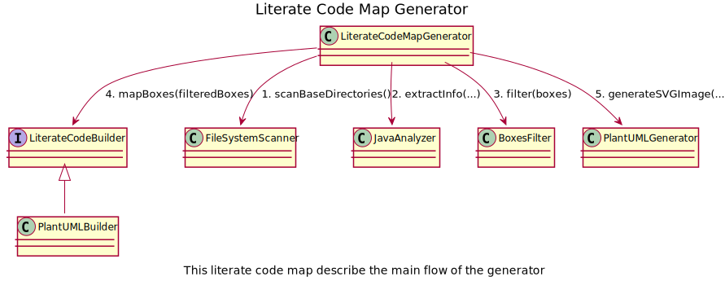

# Literate Code Maps Generator

The goal of this project is to support the (semi-)automatic generation of literate code maps.

## Design decisions

* information described in the literate code map are stored in the code (to keep them updated)
* the semantic analysis of the code is too complex in this stage of the project so we use the directives in comments to describe some information

## Code directives

### @LiterateMapInvoke(N, targetName, description)

The directive @LiterateMapInvoke make you able to add a connection between the current box and another box.
* N => order of the connection in the whole map
* targetName => name of the box that'll be connected
* description => description of the connection

## Languages

### Java

For each statement you can add elements on the map adding:

* a comment before the statement
* a comment after the statement and in the same line

## Self literate code map generation



```
./generator.sh -t 'Literate Code Map Generator' -d 'This literate code map describe the main flow of the generator' -s ./src/main/java -o generator.svg -f LiterateCodeMapGenerator,JavaAnalyzer,FileSystemScanner,PlantUMLGenerator,DiagramBuilder,LiterateCodeBuilder,PlantUMLBuilder,BoxesFilter,DiagramMapper
```

## Credits

* Literate Code Maps idea has taken from https://github.com/abulka/lcodemaps
* Java grammar has taken from https://github.com/antlr/grammars-v4
